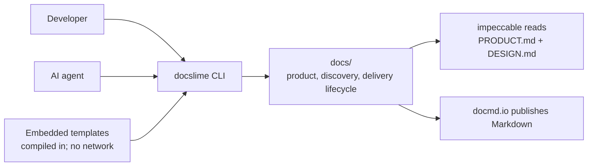

# Architecture

DocSlime is a small monorepo with three shippable surfaces: a self-contained Rust CLI, a `docmd.io`-built documentation site, and a bundled set of agent skills. The CLI has no server, no database, and no runtime dependencies: the entire template tree is compiled into the binary, and every command operates directly on the filesystem relative to the current directory.

The design is deliberately small: parse a command, resolve a template, write files without clobbering existing ones, and leave judgment-heavy work to skills. `docs/PRODUCT.md` and `docs/DESIGN.md` are part of the generated tree so tools like `impeccable` can discover context from `docs/`; publication remains outside the binary in the `docmd.io` system.

## Context diagram

Inside the CLI boundary: argument parsing, template resolution, and file writing. Outside: the git repo's filesystem, the AI agent skills that fill and review docs, `impeccable` context loading, and `docmd.io` publication.

## Components

| Component | Responsibility | Depends on |
| --- | --- | --- |
| `cli` | Define the command surface (`init`, `add`, `list`) and arguments via clap derive. KISS is intentionally not a CLI subcommand. | clap |
| `main` | Parse args, resolve the working directory, dispatch to a command, map errors to an exit code. | cli, commands |
| `commands::init` | Scaffold the full template tree into `docs/`, skipping current or legacy-equivalent existing files. | templates, scaffold |
| `commands::add` | Resolve a single template by name, or create the next-numbered ADR with a normalized slug. | templates, scaffold |
| `commands::list` | List every template and whether it already exists on disk. | templates, scaffold |
| `templates` | Hold the compile-time-embedded template tree and ADR template; resolve current and legacy `add` names and legacy path equivalents. | include_dir |
| `scaffold` | Compute output paths and write files non-destructively (honoring `--force`); track outcomes. | std::fs |
| `docs site` | Publish the product docs and homepage from `docs/` with `docmd build`. | `@docmd/core`, `docmd.config.json` |
| `agent skills` | Teach compatible AI agents how to install, initialize, fill, review, and maintain DocSlime docs. | `.agents/skills`, `agents/openai.yaml` |

## Data model

DocSlime is essentially stateless — it stores nothing of its own. The only persistent artifacts are:

- **Embedded templates** — a read-only directory tree (`templates/`) plus the standalone ADR template (`assets/adr.md`), baked into the binary at build time.
- **The output `docs/` tree** — plain Markdown files written into the user's repo, including `PRODUCT.md` and `DESIGN.md` for product/design context discovery.

The one piece of derived state computed at runtime is the **next ADR number**, obtained by scanning the ADR directory for the highest `NNNN-*` prefix.

## Problem model and terminology

DocSlime uses domain modeling to bring the concepts, relationships, constraints, and workflows of the real-world problem into the development cycle. Model the problem clearly, use the same terminology throughout the project, and ensure the software reflects the meaningful concepts, rules, and workflows of that problem.

| Concept | Meaning in DocSlime | Relationships, states, and rules |
| --- | --- | --- |
| Target project | The repository where DocSlime writes documentation. | Owns one generated docs tree; existing files are preserved unless `--force` is explicit. |
| Template catalog | The embedded Markdown tree and ADR template available to scaffold. | Supplies initial documents; it is read-only at runtime and changes only when the binary is rebuilt. |
| Docs tree | The project-specific documentation workspace under `docs/`. | Begins as a template, may omit irrelevant areas, and connects product context, experience evidence, requirements, architecture, verification, decisions, publication, and production learning. |
| Document lifecycle | The progression from scaffold guidance to project-specific content and later maintenance. | A document is scaffolded, filled, reviewed, published when applicable, and refined as understanding changes; existing user files remain untouched by default. |
| Write outcome | The result of attempting to write a template or ADR. | `Created`, `Skipped`, and `Overwritten` are explicit outcomes; overwrite requires `--force`. |
| Lifecycle trace | The connection from a real-world problem through a shared model, product decisions, implementation, and verification. | Preferred terminology, rules, workflows, requirements, interfaces, tests, decisions, and production evidence should remain linked and consistent. |
| Decision record | A numbered ADR explaining a significant product or technical choice. | Created from the next available number, linked to affected requirements or concepts, and retained as durable rationale. |
| Publication artifact | A verified CLI release, skill package, or rendered documentation site delivered to users. | Must pass its gates, follow the applicable promotion path, and be verified through a user-facing path. |

The CLI does not persist a runtime model or lifecycle database. These concepts clarify the files, states, rules, and workflows already present in the product.

### Responsibility boundaries

- **CLI scaffold:** resolve templates, create or list documents, and report non-destructive write outcomes.
- **Agent skills:** interview people, turn project knowledge into documentation, review quality, and record decisions with human input.
- **Project documentation:** hold the shared terminology, model, product decisions, requirements, implementation guidance, verification evidence, and learning trace.
- **Publishing systems:** build, version, promote, verify, and recover CLI, skill, and documentation artifacts through their distribution paths.
- **Observation practice:** turn verification failures, feedback, health signals, and outcomes into evidence that refines the problem model and future decisions.

## Key flows

### `docslime init` (scaffold the tree)

1. `main` resolves the current working directory as the root — `main`
2. Dispatch to the init command — `commands::init`
3. Enumerate every embedded template in the tree, including `PRODUCT.md` and `DESIGN.md` — `templates`
4. For each, compute `docs/<relative-path>` and skip it when the current path or a mapped legacy equivalent exists, unless `--force` explicitly writes the current template — `templates`, `scaffold`
5. Report a summary of created vs. skipped files — `commands::init`

### `docslime add adr <slug>` (create an ADR)

1. Dispatch to the add command; detect the literal `adr` — `commands::add`
2. Normalize the slug to `[a-z0-9-]`; reject if empty — `commands::add`
3. Scan `docs/engineering/adrs/` for the highest `NNNN` prefix and add one — `commands::add`
4. Write `NNNN-<slug>.md` from the embedded ADR template, non-destructively — `scaffold`

These line up with the "Scaffold the docs tree" and "Record an architecture decision" journeys in [`../experience/README.md`](../experience/README.md).

## Cross-cutting concerns

- **Error handling:** `anyhow` propagates errors up to `main`, which prints `error: …` and returns a non-zero `ExitCode`. Unknown template names produce a helpful error listing valid names (FR-8).
- **Configuration:** none — behavior is fixed by the embedded templates and a small set of flags (`--force`). No config file (see open questions in [`../REQUIREMENTS.md`](../REQUIREMENTS.md)).
- **Security:** `docslime` only writes within `docs/` under the current directory and never overwrites without `--force` (NFR-4). No network access.
- **Observability:** plain stdout/stderr; `list` uses `owo-colors` for readable status output.
- **External tools:** `impeccable` and `docmd.io` consume the Markdown tree; they are not runtime dependencies of the CLI.

## Decisions

- [Embed templates in the binary at compile time](adrs/0001-embed-templates-in-binary.md) — keeps DocSlime a zero-dependency single binary.

## Risks & trade-offs

- **Editing a template requires a rebuild.** Because templates are embedded via `include_dir`, content changes only ship with a new binary. Accepted: it's the price of a no-dependency single binary, and templates change rarely.
- **Fixed tree layout.** DocSlime doesn't accept a custom structure, which keeps it simple but limits teams that want a different shape. Tracked as an open question in the requirements.
- **Current-directory assumption.** All commands act on the current directory; running from the wrong place scaffolds in the wrong place. Mitigation: the `docslime-init` skill confirms the working directory first.
