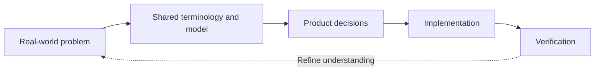
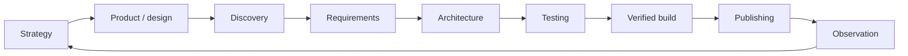

::: hero glow:true
{.docslime-hero-wordmark .docslime-hero-wordmark-light}
{.docslime-hero-wordmark .docslime-hero-wordmark-dark}

# Turn your repo into living docs.

DocSlime makes repo knowledge stick. It connects product intent and continuous discovery to requirements, architecture, tests, delivery, observability, and decisions in one local docs body that humans and agents can use.

```sh
brew install DecisionNerd/tap/docslime
```

[Install DocSlime](#install-docslime){.docmd-button} [See the docs tree](#what-docslime-creates){.docmd-button} [View on GitHub](https://github.com/DecisionNerd/DocSlime){.docmd-button}

:::

DocSlime is a small CLI plus a skill pack for creating, filling, reviewing, and publishing an opinionated `docs/` tree. The name is silly on purpose; the method is not. It pulls the scattered parts of a project into one integrated body, then gives future humans and AI agents better context for the next change.

[Read the full lifecycle guide](lifecycle/){.docmd-button .docmd-button-secondary}

## How to Use DocSlime

DocSlime separates **scaffolding** (CLI) from **judgment** (agent skills). You run commands to create files; you use skills to interview the team, fill documents, record decisions, and review for bloat.

### Quick start

```sh
brew install DecisionNerd/tap/docslime
docslime init
npx skills add DecisionNerd/DocSlime
```

Then fill `docs/PRODUCT.md` with `docslime-fill` and work through the tree in lifecycle order.

### Day-to-day commands

| What you need | Command or skill |
| --- | --- |
| See what exists | `docslime list` |
| Add one missing doc | `docslime add <name>` |
| Create the next ADR | `docslime add adr <slug>` then `docslime-adr` |
| Fill a scaffolded doc | `docslime-fill` (agent skill) |
| Review for bloat | `docslime-kiss` (agent skill) |
| Publish the site | `docmd build` (see [engineering/PUBLISHING](engineering/PUBLISHING/)) |

`init`, `add`, and `list` are CLI commands. `docslime-kiss` is intentionally a skill — it requires judgment over filled docs, not a flag.

### Recommended fill order

1. `PRODUCT.md` and `DESIGN.md` — durable product and design context
2. `experience/` — user evidence, journeys, and hypotheses
3. `REQUIREMENTS.md` — testable build contract derived from evidence
4. `engineering/ARCHITECTURE.md` and `engineering/adrs/` — problem model, system design, and decisions
5. `engineering/TESTING.md` — Given/When/Then scenarios mapped to tests
6. `engineering/PUBLISHING.md` and `engineering/OBSERVABILITY.md` — delivery and learning loop

Each template includes `<!-- LLM: ... -->` guidance. Skills follow those prompts, ask one focused question at a time, and remove scaffolding when a section is complete.

## UX, Domain Modeling, and TDD+BDD in One Trace

DocSlime encodes three practices as **links in one chain**, not separate ceremonies.

### UX — continuous discovery

The `experience/` folder captures **evidence before solutions**: observed needs, journeys, opportunities, and hypotheses. Findings become requirements only when they describe observable behavior the product must provide. This keeps UX research connected to the build contract instead of rotting in a backlog.

### Domain modeling — concepts, rules, and workflows

DocSlime uses domain modeling to bring the concepts, relationships, constraints, and workflows of the real-world problem into the development cycle. Model the problem clearly, use the same terminology throughout the project, and ensure the software reflects the meaningful concepts, rules, and workflows of that problem. Significant, hard-to-reverse choices become ADRs in `engineering/adrs/`.

### TDD+BDD — proof before promotion

Requirements get stable IDs. Behavior is written as **Given/When/Then** scenarios in `engineering/TESTING.md`. Automated tests prove observable behavior; CI gates block promotion when the contract is broken. In this repo, `tests/cli.rs` runs the real `docslime` binary against throwaway directories and maps every FR to a test case.

### The trace



When production contradicts an assumption, update `experience/` or `REQUIREMENTS.md` — the loop only works if docs stay as honest as the code.

## Why It Sticks



- **Product and design context** flows into `PRODUCT.md` and `DESIGN.md`, so agents stop guessing what the code is for.
- **Continuous discovery** lives in `experience/`, where evidence and journeys become solution-neutral requirements rather than an untraceable feature backlog.
- **Requirements and behavior** flow into `REQUIREMENTS.md` and `engineering/TESTING.md`, so TDD+BDD work can trace back to evidence.
- **Concepts, relationships, rules, workflows, and tradeoffs** flow into `engineering/ARCHITECTURE.md` and `engineering/adrs/`, so the shared model stays connected to product decisions and implementation.
- **Human judgment** flows through `docslime-fill`, `docslime-adr`, and `docslime-kiss`, so docs get filled, decisions get recorded, and bloat gets cut.
- **Delivery and observation close the loop**: `engineering/PUBLISHING.md` defines promotion, verification, and rollback; `engineering/OBSERVABILITY.md` connects production health and user outcomes back to discovery.

## Install DocSlime

Homebrew is the recommended local install path:

```sh
brew install DecisionNerd/tap/docslime
```

::: callout tip "Safe by default"
`docslime init` creates missing docs and reports what was created or skipped. It will not overwrite existing files unless `--force` is explicit. The slime eats context, not your worktree.
:::

Other install paths stay available when Homebrew is not the right fit.

```sh
curl -LsSf \
  https://github.com/DecisionNerd/DocSlime/releases/latest/download/docslime-installer.sh \
  | sh
```

```sh
cargo install \
  --git https://github.com/DecisionNerd/DocSlime \
  --bins
```

## First Run Path

::: grids
::: grid
::: card "1. Initialize" icon:terminal

```sh
docslime init
```

Create the standard docs tree and leave clear next steps in the repo.
:::
:::

::: grid
::: card "2. Fill" icon:messages-square

```sh
npx skills add DecisionNerd/DocSlime
```

Use `docslime-fill` to interview the team and replace scaffold guidance with real context.
:::
:::

::: grid
::: card "3. Decide" icon:scroll-text

```sh
docslime add adr choose-storage-boundary
```

Record significant product and technical choices while they are still fresh.
:::
:::

::: grid
::: card "4. Keep It Lean" icon:scissors
Run `docslime-kiss` as an agent skill to find bloat, contradictions, stale placeholders, and weak traceability before docs become ceremony.
:::
:::
:::

The recommended happy path is short: install the CLI, run `docslime init`, add the skill pack, fill `docs/PRODUCT.md`, then use `docslime-kiss` once the first useful context exists.

## What DocSlime Creates

```text
docs/
|-- README.md
|-- PRODUCT.md
|-- DESIGN.md
|-- REQUIREMENTS.md
|-- strategy/README.md
|-- experience/README.md
`-- engineering/
    |-- README.md
    |-- ARCHITECTURE.md
    |-- TESTING.md
    |-- PUBLISHING.md
    |-- OBSERVABILITY.md
    `-- adrs/README.md
```

`docs/PRODUCT.md` and `docs/DESIGN.md` are deliberately discoverable from the docs tree so tools like `impeccable` can load product and design context without duplicate root files.

This is a starting template, not a compliance checklist. Tailor it to the project and keep only the artifacts that reduce ambiguity for its actual consumers. A backend API in a large organization may link to product strategy and design context owned elsewhere while retaining `experience/` for developer experience, integration journeys, and agent experience.

- **Product + design:** `PRODUCT.md`, `DESIGN.md`, and `strategy/` capture purpose, voice, principles, and success measures.
- **Experience + requirements:** `experience/` captures evidence, opportunities, journeys, and hypotheses; `REQUIREMENTS.md` translates them into a testable build contract.
- **Architecture + ADRs:** `engineering/ARCHITECTURE.md` and `engineering/adrs/` keep the shared problem model, responsibility boundaries, and decisions explicit.
- **Testing:** `engineering/TESTING.md` ties TDD and BDD coverage back to requirements and journeys.
- **Publishing + observability:** [`engineering/PUBLISHING.md`](engineering/PUBLISHING/) and [`engineering/OBSERVABILITY.md`](engineering/OBSERVABILITY/) carry verified artifacts to users and feed production evidence back into discovery.

## Agent Skills

DocSlime keeps judgment-heavy work in skills instead of pretending every review belongs in a CLI subcommand.

- `docslime-install` and `docslime-init` verify the CLI and scaffold the docs tree without overwriting existing work.
- `docslime-fill` interviews the user, replaces scaffold guidance, and keeps facts anchored in the repo.
- `docslime-adr` creates the next-numbered ADR and writes the decision in the project vocabulary.
- `docslime-kiss` reviews for contradictions, generic AI prose, weak traceability, and overgrown docs.

## Read Next

::: grids
::: grid
::: card "Lifecycle" icon:workflow
[How UX, domain modeling, and TDD+BDD connect](lifecycle/){.docmd-button .docmd-button-secondary}
:::
:::

::: grid
::: card "Product" icon:target
[Understand the product model](PRODUCT/){.docmd-button}
:::
:::

::: grid
::: card "Experience" icon:route
[See continuous discovery](experience/){.docmd-button}
:::
:::

::: grid
::: card "Requirements" icon:list-checks
[Review the behavior contract](REQUIREMENTS/){.docmd-button}
:::
:::

::: grid
::: card "Design" icon:palette
[Open the design context](DESIGN/){.docmd-button}
:::
:::

::: grid
::: card "Engineering" icon:wrench
[Follow the engineering lifecycle](engineering/){.docmd-button}
:::
:::
:::
