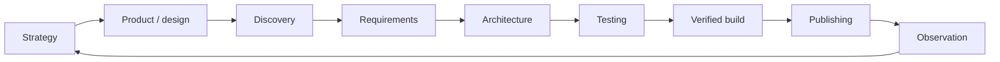
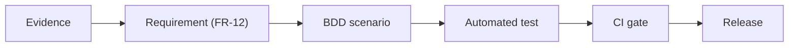

# Documentation Lifecycle

DocSlime is not just a folder generator. It encodes a full product-and-engineering loop: learn from users, write a testable contract, shape the domain, prove behavior, ship verified artifacts, and feed production evidence back into discovery.

The CLI scaffolds the tree. Agent skills do the judgment-heavy work. Your job is to keep the trace honest: every important behavior should be followable from evidence to proof.

## The closed loop



| Phase | Question | Primary docs | Methods |
| --- | --- | --- | --- |
| Strategy | Where are we playing and why? | `strategy/`, `PRODUCT.md` | Positioning, bets, audience |
| Product & design | What are we building and how should it feel? | `PRODUCT.md`, `DESIGN.md` | Product intent, design principles |
| Continuous discovery (UX) | What do users actually need? | `experience/` | Evidence, journeys, hypotheses |
| Requirements | What must the system demonstrably do? | `REQUIREMENTS.md` | Solution-neutral FR/NFR IDs |
| Architecture (DDD) | How is the domain shaped? | `engineering/ARCHITECTURE.md`, `engineering/adrs/` | Domain language, boundaries, ADRs |
| Testing (TDD+BDD) | How do we prove it before release? | `engineering/TESTING.md` | Given/When/Then, test mapping |
| Publishing | How do verified artifacts reach users? | `engineering/PUBLISHING.md` | CI gates, promotion, rollback |
| Observability | What does production teach us? | `engineering/OBSERVABILITY.md` | Signals, SLOs, learning loop |

## How to use DocSlime day to day

### 1. Scaffold the tree

```sh
brew install DecisionNerd/tap/docslime   # once per machine
docslime init                            # once per repo
npx skills add DecisionNerd/DocSlime     # once per agent environment
```

`docslime init` creates the lifecycle-oriented `docs/` tree and skips anything you already wrote. Use `docslime list` to see what exists and `docslime add <name>` to add one missing document.

Treat that tree as a starting template. Before filling it, identify the project type and its human and agent consumers, then remove or merge irrelevant files and update `docs/README.md`. For example, a backend API in a large organization may not own product strategy or visual design, but `experience/` can still capture developer experience, integration friction, operator journeys, and agent experience.

### 2. Fill durable context first

Use `docslime-fill` (or `/docslime-fill` in a skill-aware agent) in this order:

1. `PRODUCT.md` — problem, vision, stakeholders, success measures
2. `DESIGN.md` — principles, voice, interaction rules for CLI/docs/site/skills
3. `strategy/` — only when positioning or roadmap needs more room than `PRODUCT.md`
4. `experience/` — evidence, journeys, opportunities, and behavior hypotheses

Each template carries `<!-- LLM: ... -->` guidance. The skill interviews you, replaces prompts with real facts, and removes scaffolding comments when a section is done.

### 3. Translate evidence into a build contract

Fill `REQUIREMENTS.md` after product, design, and discovery context exist. Requirements must be:

- **Solution-neutral** — say what must be true, not how to implement it
- **Testable** — each FR/NFR should be provable
- **Traceable** — link back to journeys or evidence in `experience/`

When a finding in `experience/` identifies observable behavior the product must provide, it becomes a requirement. Implementation choices belong in architecture or an ADR.

### 4. Shape the domain and record decisions (DDD)

Fill `engineering/ARCHITECTURE.md` to name the components, data, and boundaries that satisfy the requirements. DocSlime uses Domain Driven Design **lightly**:

- Name the **domain concepts** that affect behavior (not abstract "document management")
- Draw **boundaries** between CLI scaffold, agent skills, publishing, and observation
- Keep **ubiquitous language** consistent across requirements, architecture, and ADRs
- Stay light on small projects — say when a bounded context is not worth formalizing

When a choice is hard to reverse, record it:

```sh
docslime add adr choose-storage-boundary
```

Then use `docslime-adr` to write the decision in project vocabulary with context, consequences, and links to requirements.

### 5. Prove behavior (TDD+BDD)

Fill `engineering/TESTING.md` to define how the contract is verified:

| Layer | Purpose | DocSlime example |
| --- | --- | --- |
| **BDD scenarios** | Given/When/Then behavior from requirements | "Given empty dir, When `init`, Then full tree exists" |
| **TDD tests** | Automated proof tied to scenarios | `tests/cli.rs` black-box CLI tests |
| **CI gates** | Block promotion without proof | `.github/workflows/ci.yml` |

The traceability bar: every important FR should map to at least one scenario and one test (or an explicit reason why automation is not appropriate).

### 6. Ship and verify

Fill `engineering/PUBLISHING.md` with the real promotion path: artifacts, versioning, CI gates, deployment verification, and rollback. DocSlime itself promotes `staging` → `main` for the site and uses tag-driven releases for the CLI.

As optional defaults, consider Semantic Versioning when public compatibility needs a clear `MAJOR.MINOR.PATCH` contract and Conventional Commits when structured change intent would help reviews, changelogs, or release automation. Preserve an effective existing workflow; do not add enforcement or rewrite history without explicit team agreement.

### 7. Learn from production

Fill `engineering/OBSERVABILITY.md` to connect system health and user-outcome signals back to requirements and discovery hypotheses. When production contradicts an assumption, update `experience/` or `REQUIREMENTS.md` — do not let stale docs pretend the old world is still true.

### 8. Keep it lean

Run `docslime-kiss` before merging documentation-heavy changes. It looks for:

- Contradictions between product, requirements, and architecture
- Generic AI prose with no testable claim
- Weak traceability (requirements with no tests, ADRs with no requirement link)
- Leftover `<!-- LLM: -->` guidance or `_italic prompts_`

## UX: continuous discovery in practice

The `experience/` folder is DocSlime's UX and product-discovery workspace. It is **not** a feature backlog dump.

**What belongs here:**

- Observed needs with evidence (support tickets, interviews, usage, maintainer feedback)
- User journeys and desired outcomes
- Opportunities and hypotheses ("we believe X will improve Y because Z")
- Given/When/Then scenarios that should become requirements
- Success signals you can observe after release

**What does not belong here:**

- Implementation plans (those live in architecture or ADRs)
- Committed behavior (that lives in `REQUIREMENTS.md`)
- Unvalidated assumptions written as facts

When evidence earns its own file, create a focused lowercase-kebab-case markdown file under `experience/` using the artifact shape documented on the [Experience](experience/) page.

## DDD: domain language without ceremony

DocSlime does not force heavyweight Domain Driven Design. It asks architecture docs to make the system's nouns and boundaries explicit enough that the next human or agent can reason about change.

**Minimum useful DDD evidence:**

| Artifact | What to capture |
| --- | --- |
| Domain concepts | The words the team actually uses (`docs tree`, `template`, `ADR`, `skill`) |
| Boundaries | What the CLI owns vs. what agents, CI, or publishing own |
| Aggregates / invariants | Rules that must stay true (e.g. "never overwrite without `--force`") |
| ADRs | Durable decisions with consequences |

If a project has no meaningful domain split, say so in architecture instead of inventing bounded contexts.

## TDD+BDD: from intent to proof

DocSlime's development method treats docs and tests as one trace:



**Requirements** (`REQUIREMENTS.md`) hold stable IDs and observable statements.

**BDD scenarios** live in `engineering/TESTING.md` (and optionally in `experience/` while still hypothesis-level) as Given/When/Then prose.

**TDD tests** are the automated proof — in DocSlime's own repo, Rust integration tests run the compiled `docslime` binary against throwaway directories and assert on files and exit codes.

**CI** is the promotion gate — if tests fail, the behavior contract is not met.

Dogfooding example: DocSlime's [`engineering/TESTING.md`](engineering/TESTING/) maps every FR to a `tests/cli.rs` case. The site build and agent-skill validation run in CI alongside the CLI suite.

## Command and skill reference

| Task             | CLI                       | Agent skill        |
| ---------------- | ------------------------- | ------------------ |
| Install binary   | `brew install …`          | `docslime-install` |
| Scaffold tree    | `docslime init`           | `docslime-init`    |
| Add one doc      | `docslime add <name>`     | —                  |
| Add ADR shell    | `docslime add adr <slug>` | `docslime-adr`     |
| List templates   | `docslime list`           | —                  |
| Fill a document  | —                         | `docslime-fill`    |
| Review for bloat | —                         | `docslime-kiss`    |

## When to update what

| Change type | Update |
| --- | --- |
| New user evidence | `experience/` → then `REQUIREMENTS.md` if behavior changes |
| New behavior commitment | `REQUIREMENTS.md` → `engineering/TESTING.md` → tests |
| New durable technical choice | `docslime add adr …` → link from architecture |
| Release process change | `engineering/PUBLISHING.md` |
| Production surprise | `engineering/OBSERVABILITY.md` → `experience/` or requirements |

## Read next

- [Experience](experience/) — continuous discovery practice and artifact shape
- [Requirements](REQUIREMENTS/) — the behavior contract
- [Architecture](engineering/ARCHITECTURE/) — system shape and domain boundaries
- [Testing](engineering/TESTING/) — BDD scenarios and test mapping
- [Agent Skills](skills/) — skill invocation and quality bar
