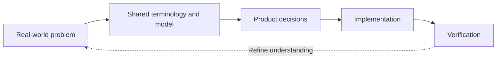

<!-- LLM: This is the entry point to the project's documentation. Keep it short and navigational. Do NOT interview the user for this file first — fill it in last, once the other docs exist, so the descriptions match what was actually written. Remove LLM comments as you complete each section. -->

# Documentation

This folder holds the living documentation for this project. Product and design context feed continuous discovery, requirements translate that evidence into a build contract, and engineering docs carry the contract through architecture, testing, publishing, and production observability. The docs stay in-repo so people and coding agents can work from the same evidence without reaching for an external source.

DocSlime uses domain modeling to bring the concepts, relationships, constraints, and workflows of the real-world problem into the development cycle. Model the problem clearly, use the same terminology throughout the project, and ensure the software reflects the meaningful concepts, rules, and workflows of that problem.

## Adapt this template to the project

This tree is a broad starting template, not a compliance checklist. Keep the documents that help this project's humans or agents make better decisions; remove, merge, or replace the rest with links to authoritative organization-level context. Update this index and affected links whenever the shape changes.

For example, a backend API service in a large organization may not need local product strategy or visual design docs when those concerns are owned elsewhere. It may still keep `experience/` to document developer experience (DX), operator and integration journeys, and agent experience for coding agents or other automated consumers of the service.

## How the docs are organized

Follow this lifecycle rather than treating the filenames as a numbered checklist:

| Document | Question it answers |
| --- | --- |
| [`PRODUCT.md`](PRODUCT.md) | What is this product, who is it for, and why does it exist? |
| [`DESIGN.md`](DESIGN.md) | What should stay consistent in product, docs, and UX experience? |
| [`experience/`](experience/) | What have we learned from users, and what outcomes and behaviors do they need? |
| [`REQUIREMENTS.md`](REQUIREMENTS.md) | What must the delivered system demonstrably do as a result? |
| [`engineering/ARCHITECTURE.md`](engineering/ARCHITECTURE.md) | Which concepts, relationships, rules, workflows, states, responsibilities, and components shape the system? |
| [`engineering/TESTING.md`](engineering/TESTING.md) | How do we prove it before release and gate continuous integration? |
| [`engineering/PUBLISHING.md`](engineering/PUBLISHING.md) | How does a verified change reach users safely? |
| [`engineering/OBSERVABILITY.md`](engineering/OBSERVABILITY.md) | How do we know it works in production and feed learning back into discovery? |

Supporting detail lives in subfolders:

| Folder | Contents |
| --- | --- |
| [`strategy/`](strategy/) | Market, positioning, business model, roadmap, and strategic bets. |
| [`experience/`](experience/) | Continuous discovery, research, opportunities, journeys, hypotheses, and behavior scenarios. |
| [`engineering/`](engineering/) | Architecture, CI, delivery, observability, operations, and decision records. |
| [`engineering/adrs/`](engineering/adrs/) | Architecture Decision Records. |

## Conventions

- **Keep docs current.** When behavior changes, update the doc in the same change.
- **Link, don't duplicate.** Reference detail in subfolders rather than copying it.
- **Trace the problem through verification.** Real-world evidence and a shared model should lead to product decisions, requirements, interfaces, implementation, Given/When/Then scenarios, tests, telemetry, and production learning.
- **Decisions are recorded.** Significant choices get an ADR (see `engineering/adrs/`).
- **Keep applicable context discoverable.** When retained, `PRODUCT.md` and `DESIGN.md` stay in `docs/` so design and coding agents can load them without duplicate root files.
- **Close the loop.** Observability should measure both system health and the user outcomes named in product, experience, and requirements docs.
- **Choose release conventions intentionally.** Consider Semantic Versioning and Conventional Commits when they clarify compatibility and change intent, but preserve a team's effective existing workflow and add enforcement only with explicit agreement.
