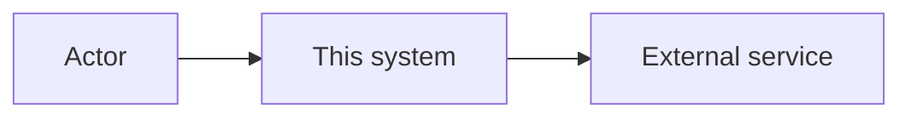

<!-- LLM: This document explains how the system is designed to meet the requirements
(../REQUIREMENTS.md). Read the prior docs first so the architecture clearly serves the
requirements and experience evidence. Interview the user about the actual or intended design — don't
invent components. Where a significant choice was made between alternatives, record it as an
ADR in adrs/ and link to it here rather than arguing the decision inline.
Remove LLM comments as you fill each section. -->

# Architecture

<!-- LLM: One-paragraph overview of the system shape (e.g. "a single-binary CLI", "a web app
with a Postgres backend"). Give the reader the mental model before the detail. -->

_What kind of system is this, in one paragraph?_

## Context diagram

<!-- LLM: Show the system in its environment — its users and the external systems it talks to.
A Mermaid flowchart is the standard for relationships and flows; do not use ASCII art. If the
relationships do not merit a diagram, use concise prose or a bullet list instead. Ask the user
what's inside the boundary vs. outside it. -->

## Components

<!-- LLM: Break the system into its major parts. For each, state its single responsibility and
what it depends on. Ask the user to walk through the pieces; capture one row per component.
Keep responsibilities crisp — if a component does "everything", probe to split it. -->

| Component | Responsibility | Depends on |
|---|---|---|
| _Name_ | _What it owns_ | _Other components / services_ |

## Data model

<!-- LLM: Describe the key entities and their relationships, or the main data structures /
state. Link to a schema file if one exists. Ask: "What are the nouns the system stores or
passes around, and how do they relate?" Remove if the system is essentially stateless. -->

_Key entities and relationships._

## Domain language and boundaries

<!-- LLM: Use Domain Driven Design lightly. Ask: "What are the core domain nouns, what words
must mean one thing here, and where are the boundaries between responsibilities?" Capture
bounded contexts only when they clarify the system. If there is no meaningful domain split,
say so and remove the table. -->

| Domain concept | Meaning in this project | Boundary / owner |
|---|---|---|
| _Concept_ | _Definition in project language_ | _Component, team, module, or external system_ |

## Key flows

<!-- LLM: Trace 1-3 important paths through the system end-to-end (e.g. the main request, the
main command). Number the steps and name the components involved. These should line up with
the relevant requirements and evidence in ../experience/. -->

### _Flow name_

1. _Step — which component_
2. _Step — which component_

## Cross-cutting concerns

<!-- LLM: How the design handles concerns that span components: error handling, logging,
configuration, auth/security, performance, observability. Ask the user which of these apply
and how they're addressed. Drop the ones that don't apply. -->

- **Error handling:** _…_
- **Configuration:** _…_
- **Security:** _…_
- **Observability:** _…_

## Decisions

<!-- LLM: List the significant architectural decisions, each linking to its ADR. Do not
re-argue them here. If no ADRs exist yet, prompt the user: "What were the big either/or
choices? Each deserves an ADR." Use `docslime add adr <slug>` to create one. -->

- _[ADR-0001 — short title](adrs/0001-*.md)_

## Risks & trade-offs

<!-- LLM: Capture where the design is knowingly weak or where a trade-off was accepted, and
why. Honest risk-listing here saves pain later. -->

- _Risk / trade-off — mitigation or rationale_
