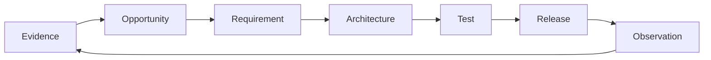

<!-- LLM: This folder is the continuous-discovery and experience-design workspace. Read ../PRODUCT.md and ../DESIGN.md first when they are retained and applicable. Interview the user about actual evidence; never invent research, users, quotes, or validation. Keep this README as the operating model and index, then create one focused file per meaningful opportunity, journey, study, or product slice. Translate validated findings into stable requirements in ../REQUIREMENTS.md rather than turning discovery notes into an untraceable backlog. Remove LLM comments as you go. -->

# Experience

This folder connects continuous discovery and experience design to delivery. It captures what the team has learned from users, the outcomes they need, the opportunities worth pursuing, and the behavior that would demonstrate improvement.

For a service, library, SDK, CLI, or API, the users may be developers, operators, integrators, coding agents, or other automated consumers. Keep experience artifacts for developer experience and agent experience even when product strategy or visual design is owned elsewhere and omitted from this repo.

## Discovery practice

<!-- LLM: Describe how the team continuously discovers needs and validates direction. Ask:
- Who participates in discovery and how often?
- Which evidence sources are trusted (interviews, support, analytics, observation, sales)?
- How are assumptions, opportunities, and experiments recorded?
- What threshold turns a finding into a requirement or product decision?
Keep this practical; do not prescribe ceremony the team will not use. -->

_How does the team learn from users and decide what is worth building?_

## Experience principles

<!-- LLM: Capture the cross-cutting qualities that should be true of every journey. Link to the corresponding design principle in ../DESIGN.md when one exists. -->

- _Principle — what it means for a user._

## Artifact template

<!-- LLM: Use this shape when creating a new opportunity, journey, study, or product-slice file. Adapt it to the evidence available; do not create empty sections just to satisfy the template. Requirements should state what must be true, not prescribe architecture. -->

```markdown
# Opportunity or experience

## Observed need and evidence

## Desired user and business outcome

## Users and context

## Current journey

## Opportunity and hypothesis

## Intended behavior

## Given / When / Then scenarios

## Constraints and domain language

## Success signals and telemetry

## Open questions

## Related requirements, tests, architecture, and ADRs
```

## Traceability

Discovery artifacts should link forward to requirements they justify. Requirements should link back here, tests should prove their acceptance behavior, and observability should show whether the intended outcome happens in production.



## Index

<!-- LLM: List only artifacts that actually exist. Use one file per substantial artifact and give each a stable, descriptive lowercase-kebab-case filename. -->

| Document | Kind | Status | What it informs |
| --- | --- | --- | --- |
| _filename.md_ | _Opportunity / journey / study / product slice_ | _Active / validated / retired_ | _Requirement, decision, or open question_ |
